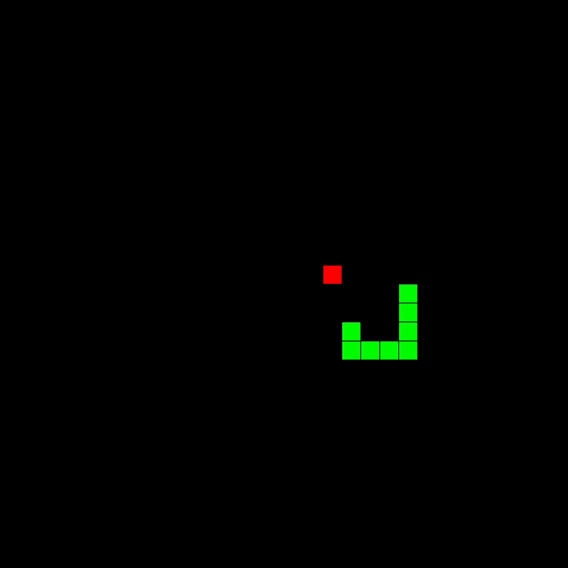
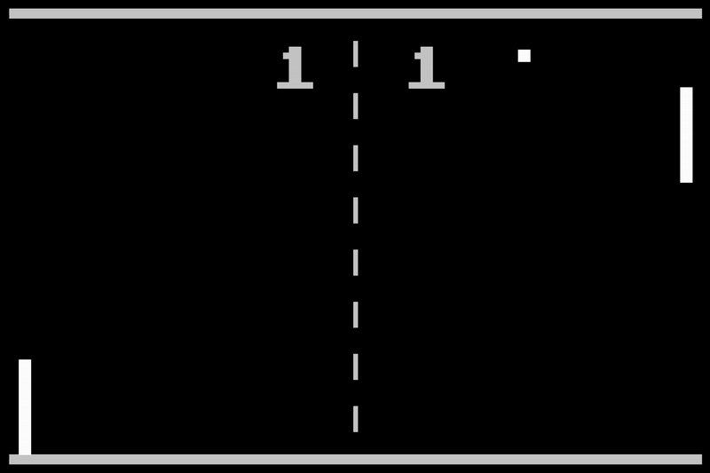
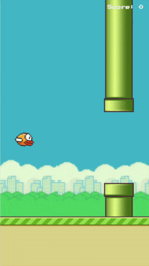

# p5games

Small collection of single-file game sketches written with p5js for fun

## Setup

To install necessary dependencies run:

```
$ npm install
```

To run a game, run:

```
$ npm run <game>
```

where `<game>` is one of the following game names: `snake, pong, flappy-bird`

## Games

### Snake



### Pong



### Flappy Bird

